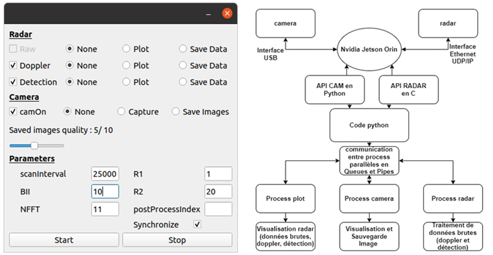
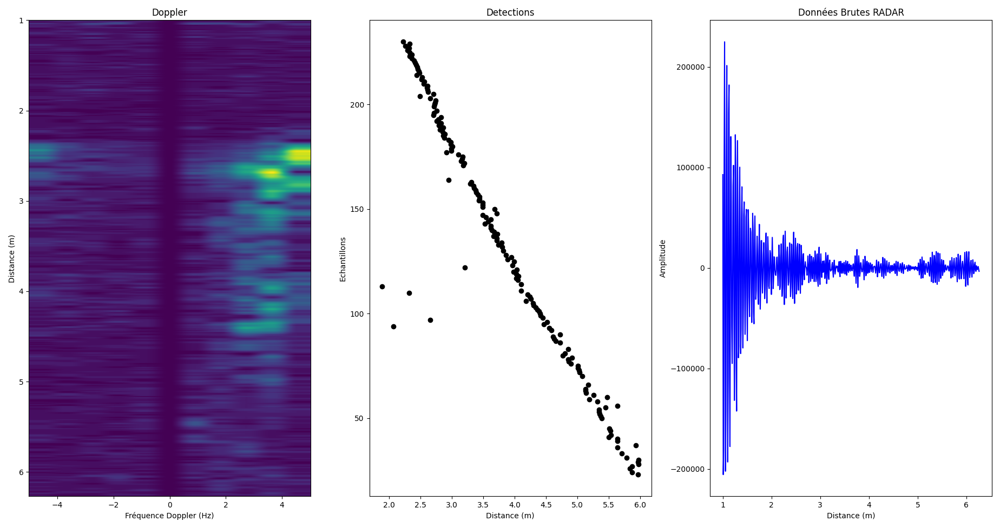

# Autonomous Train Obstacle Detection System

## Overview

This project develops an obstacle detection system for an autonomous train prototype. It leverages advanced sensors and embedded computing to detect obstacles in real-time, improving safety and operational reliability.

---

## Hardware Components

- **NVIDIA Orin**  
  Embedded prototyping system running Linux, serving as the core processing unit.

- **TDSR P440 UWB Radar**  
  Ultra-wideband radar sensor used for precise obstacle detection and distance measurement.

- **2 Basler Cameras**  
  High-quality cameras used to collect visual data for training and validating radar-based obstacle detection algorithms.

---

## Software Architecture

The project consists of two main applications, both running on the NVIDIA Orin embedded system under Linux. The radar data acquisition is implemented in C and interfaced via Python using `ctypes`. The collected data is then either post-processed to train machine learning models or processed for real-time obstacle detection on the prototype.

1. **Data Acquisition and Post-Processing App**  
   Collects synchronized sensor data from the radar and cameras. The camera data is used to **train and validate radar-based obstacle detection algorithms** via data fusion and machine learning.

2. **Prototype Obstacle Detection App**  
   Performs real-time obstacle detection using radar data enhanced by models trained with camera inputs.

## Application Interface

The system features interface that allows control of the radar and camera and data acquisition and saving of raw and processed data and images to be further post processed after:

*Main application interface

---

## Real-time Detection Visualization

The application provides comprehensive real-time visualization of the detection algorithms, including simultaneous display of radar data processing and camera feeds:

*Real-time plot showing obstacle detection algorithm results, Doppler processing, and raw radar data alongside camera feed*

---

## Getting Started

### Prerequisites

- NVIDIA Orin running Linux
- Installed dependencies for sensor drivers, machine learning libraries, and computer vision tools
- Access to TDSR P440 UWB Radar and Basler cameras

### Installation
1. Install the Python dependencies: 
- pip install -r requirements.txt

2.  Ensure the mrm.so shared library is present in the project root directory.

- This library handles radar data acquisition and must be compiled or copied from the cFiles folder.

To compile mrm.so on Linux, run the command from the cFiles folder:
cc -fPIC -shared -o mrm.so mrmMainFunctions.c mrmFunctions.c

